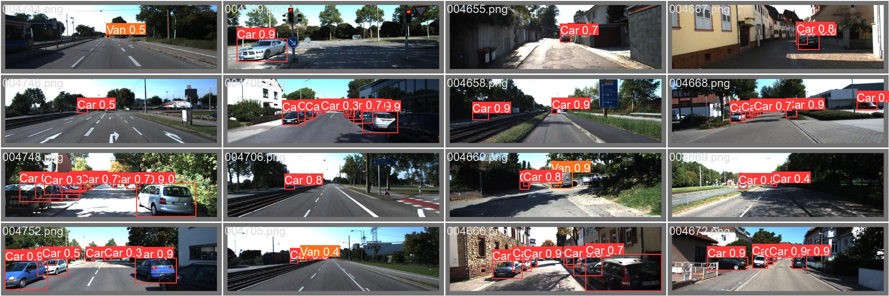
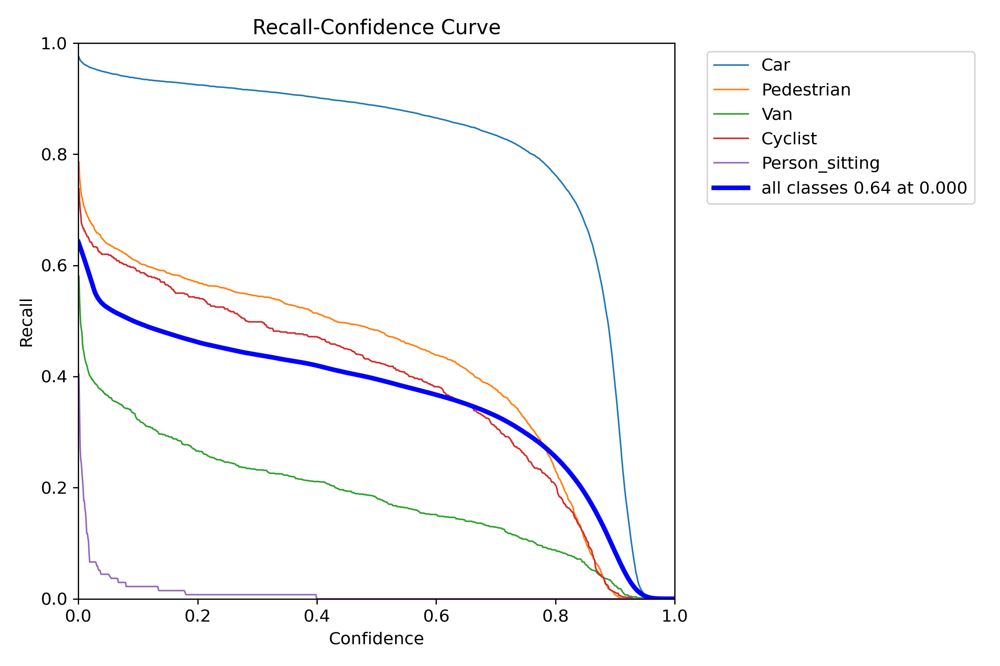
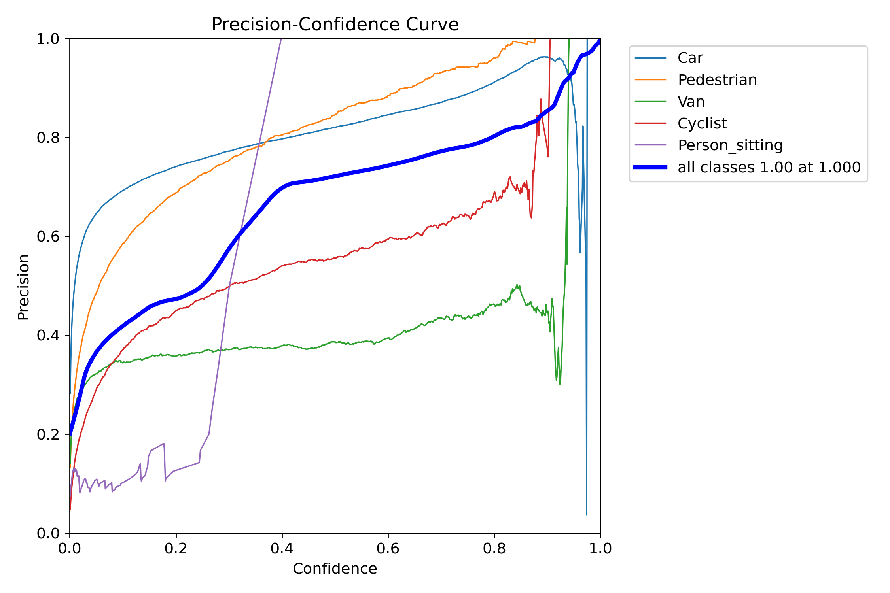

# YOLOv8 for KITTI Benchmark 

🚀 **Supercharge your Object Detection on KITTI with YOLOv8!**

Welcome to the YOLOv8_KITTI project. This repository is dedicated to training and fine-tuning the state-of-the-art YOLOv8 model specifically for KITTI dataset, ensuring superior object detection performance.



## Installation

### Set up the python environment

```
conda create -n yolov8 python=3.8
conda activate yolov8
pip install -r requirements.txt
```

### Set up datasets

#### 1. Set up workspace
Download [KITTI](https://www.cvlibs.net/datasets/kitti/eval_object.php?obj_benchmark=3d) dataset and add a link to the data directory. Your datasets path is the disk directory that stores datasets and your project path is current path.
```
ln -s /your/datasets/path/KITTI/data_object_image_2 /your/project/path/data
```

After preparation, you should have the following directory structure: 
```
data/data_object_image_2
|-- training
|   |-- image_2
|   |-- label_2
|-- testing
|   |-- image_2
......
```
   
#### 2. Generate YOLO training label format
We need to modify the original data format to a format suitable for yolov8 training. It will create a `labels_clean` folder, which contains the label files we need.
```
python generate_kitti_4_yolo.py
```
>NOTE: I remove some object labels that didn't meet the conditions, such as the height was too small, the truncation was too serious, the occlusion was too serious, etc.


#### 3. Generate YOLO train/valid file
I handled the training data in advance is divided into about 50% training set and 50% validation set, and is stored in `kitti_splits` folder. Use the following command to generate the files we need in training.
```
python main.py --type preprocess
```
After this, we will get a `train` folder containing training images and labels. A `valid` folder containing valid images and labels. A `kitti.yaml` file used for yolov8 training configuration file. A `kitti_classes.json` file containing Object classes and indexs.

#### 4. Trained model

Download the trained model from [YOLOV8-KITTI](https://pan.baidu.com/s/1JcBUJ1wX43EOcV1ZtJa5eQ?pwd=7wq1) (Pretrained on yolov8x.pt) if you need.

Put it into `./best.pt`.

## Training and Evaluation

### Training
Use the following command to train a object detection model on KITTI. It will download some pretrained model(yolov8x.pt), please wait a minute.
```
python main.py --type train
```
After trained, it will create a `yolov8x-kitti-clean` folder, which contained the training models and some information files.
>Fine-tuning for 50 epoch and 9 batch-size takes about 100 minutes, on our test machine (i5-13600KF CPU, RTX 4070 GPU).


### Evaluation
Use the following command to evaluate a object detection model on KITTI. You can download the trained model from [this section](#4.-trained-model).
```
python main.py --type evaluate --weight your/model/path/best.pt
```

All result files saved in `./runs/detect/val` folder. Following output is the precision, recall, mAP50 and mAP50-95 data on the validation set.
```
         Class     Images  Instances      Box(P          R      mAP50  mAP50-95):
           all       3769      15018      0.563       0.44      0.447      0.283
           Car       3769      10963       0.77      0.915      0.901      0.695
    Pedestrian       3769       2172      0.749      0.546      0.627      0.303
           Van       3769       1147       0.37      0.234      0.231      0.155
       Cyclist       3769        600      0.493      0.498        0.4       0.23
Person_sitting       3769        136      0.433    0.00735     0.0748     0.0343
Speed: 0.0ms preprocess, 6.0ms inference, 0.0ms loss, 0.3ms postprocess per image
```

<div style="display: flex; justify-content: space-between;">
    
    
</div>

### Prediction
Use the following command to predict the test set on KITTI using the trained model. You can download the trained model from [this section](#4.-trained-model).

```
python main.py --type predict --weight your/model/path/best.pt
```
All result images and labels saved in `./runs/detect/predict` folder.

## Citation

For additional resources and information, please see the links below:
- [KITTI](https://www.cvlibs.net/datasets/kitti/eval_object.php?obj_benchmark=3d)
- [YOLOv8](https://docs.ultralytics.com/zh/)
